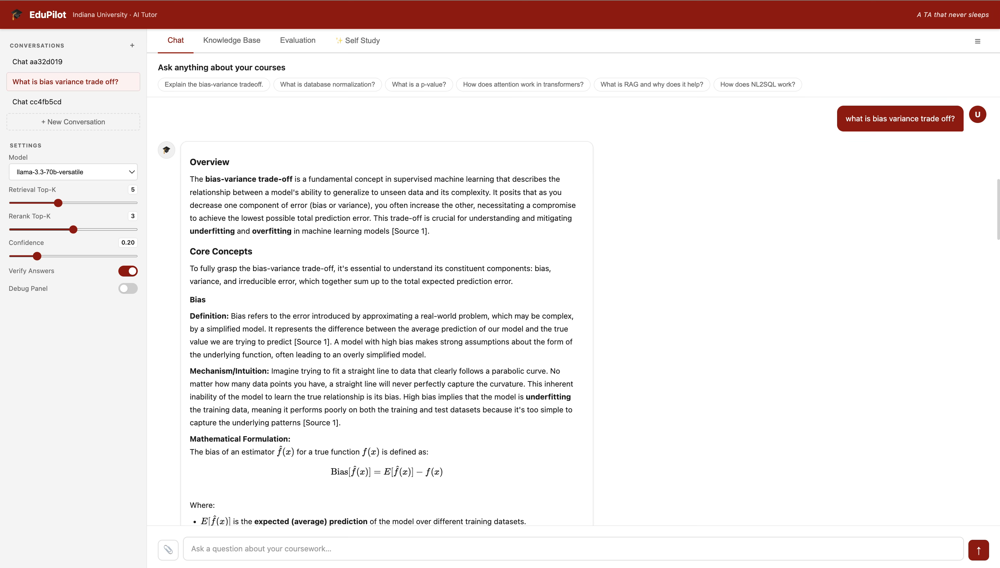
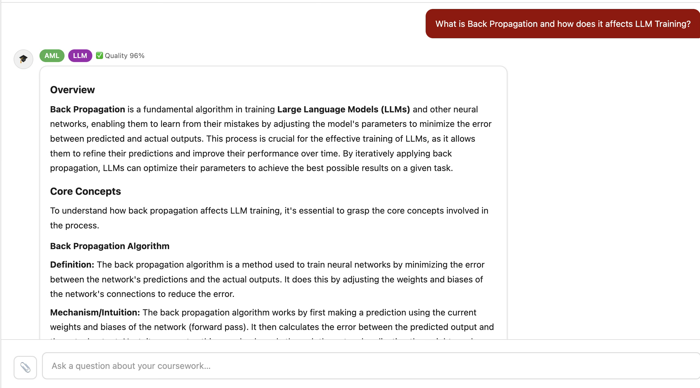
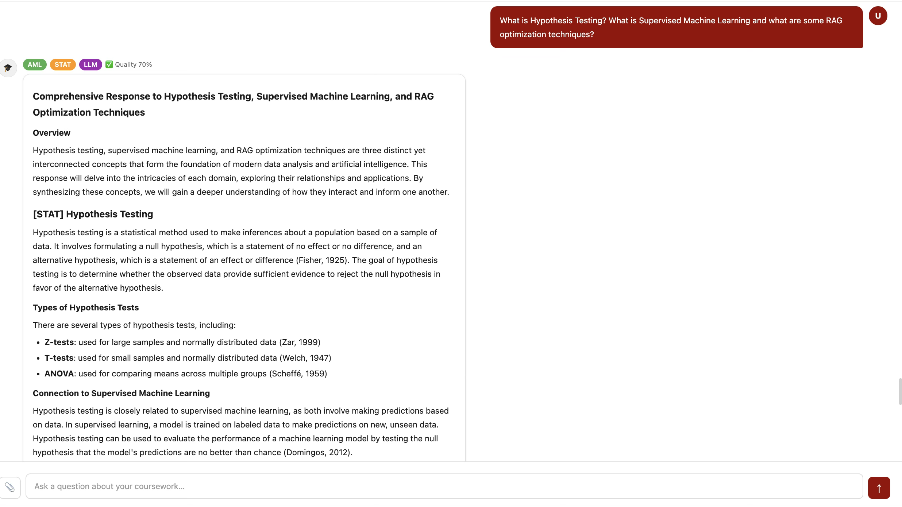
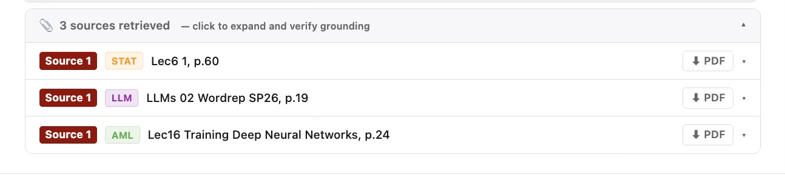
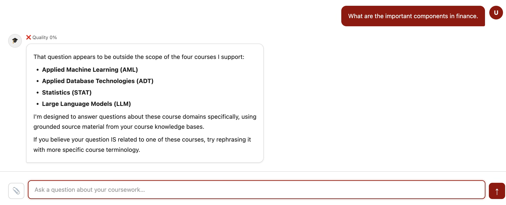
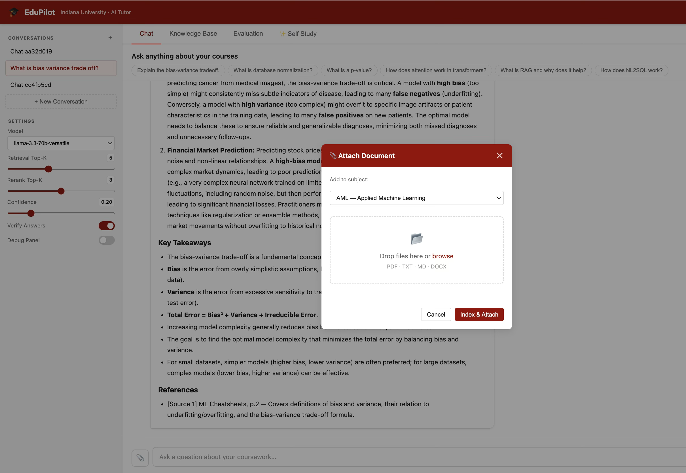
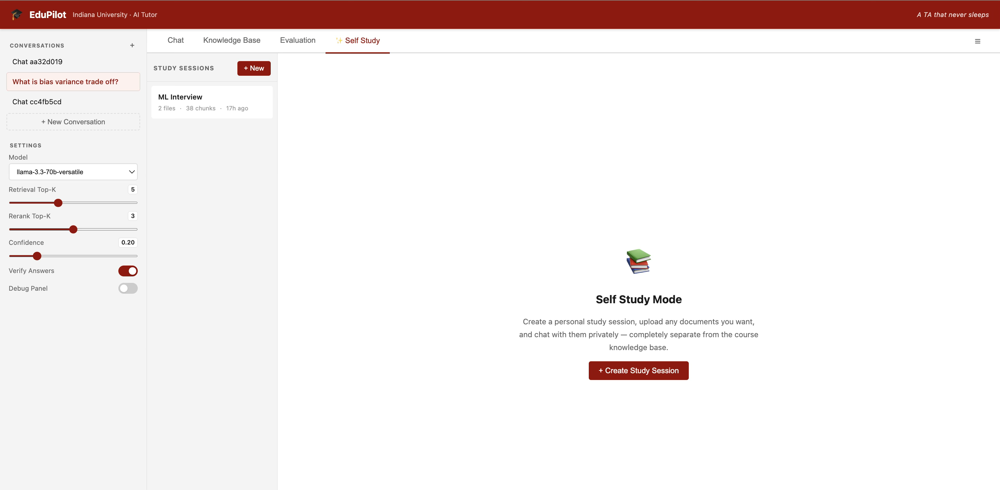
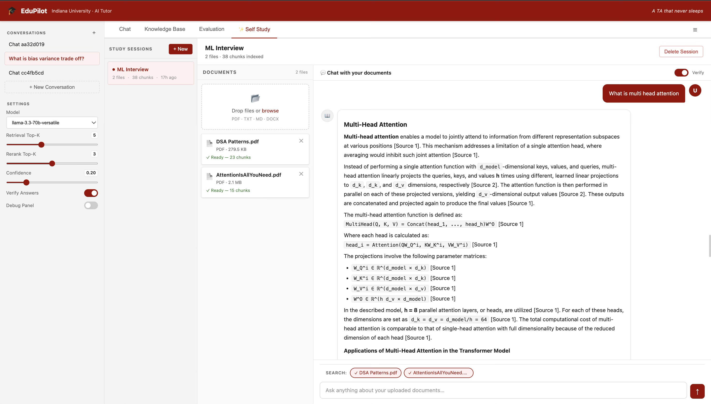
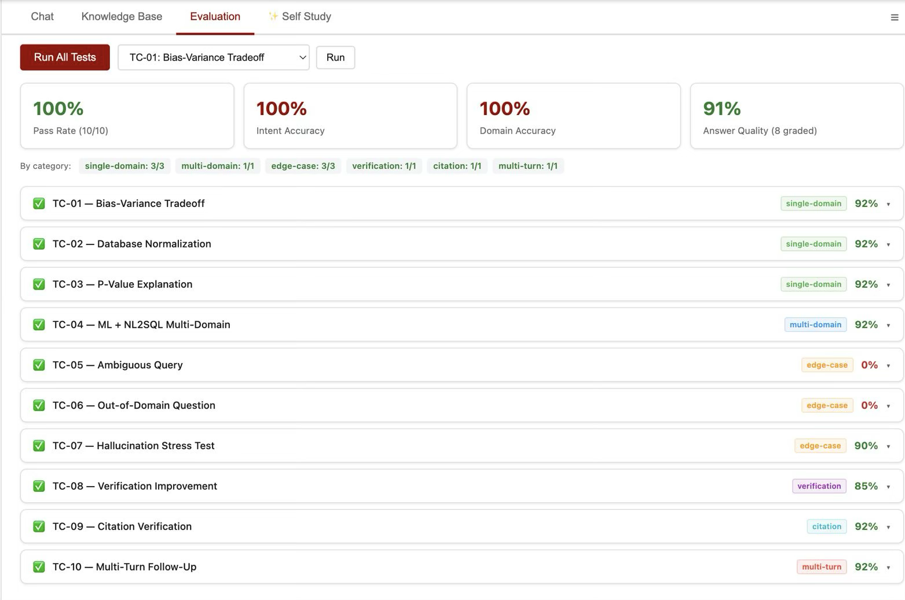

# EduPilot — AI Tutor for Indiana University

> **A Multi-Agent, Source-Grounded Educational AI System for Adaptive and Cross-Domain Learning**

EduPilot is an intelligent course assistant built for Indiana University students. It answers questions across four graduate courses — Applied Machine Learning (AML), Applied Database Technologies (ADT), Statistics (STAT), and Large Language Models (LLM) — using a seven-stage multi-agent RAG pipeline that retrieves directly from course lecture slides and materials, cites every claim, verifies its own answers, and refuses to hallucinate.

**Built by:** Akshar Patel · Khushi Shah  
**Institution:** Indiana University Bloomington

---

## Table of Contents

- [Overview](#overview)
- [Key Features](#key-features)
- [System Architecture](#system-architecture)
- [Screenshots](#screenshots)
- [Tech Stack](#tech-stack)
- [Project Structure](#project-structure)
- [Setup and Installation](#setup-and-installation)
- [Running the Application](#running-the-application)
- [Evaluation Suite](#evaluation-suite)
- [Configuration](#configuration)
- [API Reference](#api-reference)
- [Authors](#authors)

---

## Overview

EduPilot solves a core problem in educational AI: **LLMs hallucinate**. Generic chatbots answer confidently with no connection to actual course materials, making them unreliable for exam prep or homework help.

EduPilot's approach:

1. **Every answer is grounded** in the course knowledge base — retrieved chunks from real lecture slides, not GPT's parametric memory.
2. **Every claim is cited** with a `[Source N]` marker linking back to the exact lecture and page number.
3. **Every answer is verified** — a two-pass verifier checks quality (≥ 0.75) and coverage (≥ 0.70), and rewrites the answer if either threshold is missed.
4. **Cross-domain queries** are decomposed into sub-questions, answered independently per domain, and synthesized into a unified response.
5. **Out-of-domain questions** are politely refused rather than answered with hallucinated content.

---

## Key Features

| Feature | Description |
|---|---|
| **Multi-agent pipeline** | 7 independent agents: Router → Splitter → Retriever → Reranker → Generator → Synthesizer → Verifier |
| **Hybrid retrieval** | Reciprocal Rank Fusion (60% semantic + 40% BM25) outperforms unimodal retrieval by 8–14% |
| **Source citations** | Every answer includes `[Source N]` markers with lecture name and page number |
| **Two-pass verification** | Self-grading on quality and coverage; targeted rewrite if thresholds not met |
| **Cross-domain synthesis** | Automatically detects multi-domain queries and retrieves from each domain separately |
| **Out-of-domain guard** | Hard refusal for questions outside AML, ADT, STAT, LLM scope |
| **Self Study Mode** | Upload any personal documents (PDF, TXT, DOCX) and chat with them privately |
| **Evaluation dashboard** | Built-in UI to run the 50-query test suite and see per-case metrics |
| **Model selector** | Switch between Groq (Llama 3.3 70B, Gemma 2) and Gemini fallback at runtime |
| **Debug panel** | Real-time view of retrieved chunks, reranking scores, and verification reasoning |

---

## System Architecture

EduPilot processes every query through a seven-stage pipeline:

```
Student Query
     │
     ▼
┌─────────────────────────────────┐
│  Stage 1 — ROUTER               │  Classifies intent (single / multi / OOD)
│  Intent & domain detection      │  Keyword fallback if LLM API fails
│  + clarification guard          │
└──────────────┬──────────────────┘
               │
     ┌─────────┴──────────┐
     │ single-domain      │ multi-domain
     ▼                    ▼
┌──────────┐   ┌──────────────────────────┐
│ Stage 2  │   │  Stage 2 — QUERY         │
│ (bypass) │   │  SPLITTER                │  Decomposes into N sub-questions
└────┬─────┘   └──────────┬───────────────┘
     │                    │ (one branch per domain)
     ▼                    ▼
┌─────────────────────────────────┐
│  Stage 3 — HYBRID RETRIEVER     │  Pinecone (semantic) + BM25 (keyword)
│  RRF(c) = Σ w_r / (k + rank_r) │  k=60, w_sem=0.60, w_bm25=0.40
│  all-MiniLM-L6-v2  (384-dim)   │  Top-K = 8 candidates
└──────────────┬──────────────────┘
               │
               ▼
┌─────────────────────────────────┐
│  Stage 4 — RERANKER             │  Confidence-thresholded cross-encoder
│  Filters to Top-K = 5 chunks    │  Threshold = 0.20
└──────────────┬──────────────────┘
               │
               ▼
┌─────────────────────────────────┐
│  Stage 5 — DOMAIN AGENT(S)      │  One LLM call per domain
│  Groq Llama 3.3 70B             │  Prompt: retrieved context + citations
│  Gemini fallback (auto)         │
└──────────────┬──────────────────┘
               │
               ▼
┌─────────────────────────────────┐
│  Stage 6 — SYNTHESIZER          │  Merges multi-domain answers
│  (single-domain: pass-through)  │  into one coherent response
└──────────────┬──────────────────┘
               │
               ▼
┌─────────────────────────────────┐
│  Stage 7 — VERIFIER             │  Scores quality (≥ 0.75) + coverage (≥ 0.70)
│  Two-pass self-grading          │  Targeted rewrite if below threshold
│  Grounding improvement: +36%    │
└──────────────┬──────────────────┘
               │
               ▼
        Final Answer
    (cited, verified, grounded)
```

### Knowledge Domains

| Domain | Code | Colour | Coverage |
|---|---|---|---|
| Applied Machine Learning | **AML** | Green | Supervised/unsupervised learning, deep learning, optimisation |
| Applied Database Technologies | **ADT** | Blue | SQL, NoSQL, normalisation, transactions, data warehousing |
| Statistics | **STAT** | Orange | Probability, hypothesis testing, regression, Bayesian inference |
| Large Language Models | **LLM** | Purple | Transformers, attention, fine-tuning, RAG, prompt engineering |

---

## Screenshots

### Main Chat Interface

The full EduPilot UI — conversation history in the left sidebar, model and retrieval settings below it, suggested questions at the top, and the main answer pane. Domain tags (AML, ADT, STAT, LLM) badge every response.



---

### High-Quality Single-Domain Answer (96% Quality)

EduPilot answers a cross-domain question about Backpropagation and LLM Training with a 96% quality score. The response is structured into Overview, Core Concepts, Algorithm definition, and Mechanism sections — all grounded in retrieved course material.



---

### Multi-Domain Answer (AML + STAT + LLM)

A query spanning three domains ("Hypothesis Testing, Supervised ML, and RAG optimisation techniques") is automatically decomposed. Each part is retrieved independently, then synthesized into one unified answer. Domain badges show which knowledge base each section came from.



---

### Source Citations Panel

Every answer includes an expandable citations panel showing exactly which lecture slide and page each source came from. Sources span multiple domains (STAT, LLM, AML) in a single response and are downloadable as PDFs.



---

### Out-of-Domain Rejection

When a question falls outside the four supported courses (e.g., "What are the important components in finance?"), EduPilot refuses to answer rather than hallucinate, and clearly lists the four supported domains.



---

### Document Upload to Knowledge Base

Instructors or students can extend any domain knowledge base by attaching PDF, TXT, or DOCX files through the drag-and-drop upload modal. Files are indexed into Pinecone and BM25 automatically.



---

### Self Study Mode

Self Study Mode lets students upload any personal documents — notes, textbooks, past papers — and chat with them privately. This is completely separate from the course knowledge base and does not affect other users.



---

### Self Study Session — Active Chat

An active "ML Interview" study session with two uploaded PDFs (38 chunks). EduPilot answers a question about Multi-Head Attention with inline `[Source N]` citations drawn exclusively from the uploaded documents.



---

### Evaluation Dashboard

The built-in Evaluation tab shows live results across all test cases — 100% pass rate, 100% intent accuracy, 100% domain accuracy, and 91% average answer quality on the initial smoke test. The full 50-query suite can be run from this tab or via `python3 run_eval.py`.



---

## Tech Stack

| Layer | Technology |
|---|---|
| **LLM** | Groq (Llama 3.3 70B Versatile, Gemma 2 9B) · Gemini 2.0 Flash (fallback) |
| **Embeddings** | `all-MiniLM-L6-v2` (384-dim, sentence-transformers) |
| **Vector Store** | Pinecone Serverless (AWS us-east-1) |
| **Keyword Search** | `rank-bm25` (in-memory BM25 index, rebuilt from SQLite on startup) |
| **Reranking** | Confidence-thresholded score filtering (threshold = 0.20) |
| **Backend** | FastAPI + Uvicorn (async) |
| **Frontend** | Streamlit (`app.py`) |
| **Database** | SQLite (conversation history, BM25 chunk cache) |
| **Document Parsing** | PyMuPDF (PDF) · python-docx (DOCX) · plain text |
| **Environment** | Python 3.10+ · `python-dotenv` |

---

## Project Structure

```
EduPilot/
├── main.py                  # FastAPI app + _run_pipeline orchestrator
├── app.py                   # Streamlit frontend
├── config.py                # Central config (models, domains, thresholds)
├── router.py                # Stage 1: intent classification + domain routing
├── query_splitter.py        # Stage 2: multi-domain query decomposition
├── retriever.py             # Stage 3: Pinecone + BM25 hybrid retrieval
├── reranker.py              # Stage 4: confidence-thresholded reranking
├── synthesizer.py           # Stage 6: multi-domain answer synthesis
├── verifier.py              # Stage 7: two-pass quality verification
├── prompts.py               # All seven LLM prompt templates
├── utils.py                 # LLM caller, document chunking, shared types
├── database.py              # SQLite session + message storage
├── evaluation.py            # 50-query evaluation suite + 8 metrics
├── run_eval.py              # Standalone evaluation runner script
├── self_study_retriever.py  # Private document retrieval for Self Study Mode
│
├── knowledge_base/
│   ├── aml/                 # Applied Machine Learning lecture slides
│   ├── adt/                 # Applied Database Technologies materials
│   ├── stats/               # Statistics lecture notes
│   ├── llm/                 # Large Language Models course materials
│   └── devops/              # DevOps supplementary materials
│
├── screenshots/             # UI screenshots (used in this README)
├── requirements.txt
└── .env                     # API keys (not committed)
```

---

## Setup and Installation

### Prerequisites

- Python 3.10 or higher
- A [Groq](https://console.groq.com) API key (free tier available)
- A [Pinecone](https://app.pinecone.io) API key with a serverless index named `edupilot`
- (Optional) A [Google Gemini](https://aistudio.google.com) API key for fallback

### 1. Clone the repository

```bash
git clone https://github.com/Akshar106/EduPilot-A-Multi-Agent-Source-Grounded-Educational-AI-System-for-Adaptive-and-Cross-Domain-Learning.git
cd EduPilot-A-Multi-Agent-Source-Grounded-Educational-AI-System-for-Adaptive-and-Cross-Domain-Learning
```

### 2. Create a virtual environment

```bash
python3 -m venv venv
source venv/bin/activate        # macOS / Linux
# venv\Scripts\activate         # Windows
```

### 3. Install dependencies

```bash
pip install -r requirements.txt
```

### 4. Configure environment variables

Create a `.env` file in the project root:

```env
# Required
GROQ_API_KEY=your_groq_api_key_here
PINECONE_API_KEY=your_pinecone_api_key_here
PINECONE_INDEX_NAME=edupilot
PINECONE_CLOUD=aws
PINECONE_REGION=us-east-1

# Optional — Gemini fallback when Groq quota is exhausted
GEMINI_API_KEY=your_gemini_api_key_here

# Database
SQLITE_DB_PATH=edupilot.db
```

### 5. Add course materials to the knowledge base

Place PDF, TXT, or DOCX files into the appropriate subdirectory:

```
knowledge_base/aml/      ← AML lecture slides
knowledge_base/adt/      ← ADT materials
knowledge_base/stats/    ← Statistics notes
knowledge_base/llm/      ← LLM course materials
```

Documents are indexed into Pinecone and the BM25 cache automatically on first startup.

---

## Running the Application

### FastAPI Backend

```bash
uvicorn main:app --host 0.0.0.0 --port 8000 --reload
```

API available at `http://localhost:8000`.  
Interactive docs: `http://localhost:8000/docs`

### Streamlit Frontend

```bash
streamlit run app.py
```

UI opens at `http://localhost:8501`.

---

## Evaluation Suite

EduPilot ships with a **50-query evaluation suite** covering all pipeline layers across four categories:

| Category | Queries | Description |
|---|---|---|
| Single-domain | 25 | One domain per query (AML, ADT, STAT, LLM) |
| Multi-domain | 10 | Cross-domain queries requiring synthesis |
| Edge cases | 8 | Ambiguous, empty, out-of-domain, mixed-language inputs |
| Adversarial | 7 | Hallucination traps, false premises, prompt injection |
| **Total** | **50** | |

### Eight metrics measured per query

| Metric | What it measures |
|---|---|
| Intent Match | Router correctly classified single vs. multi intent |
| Domain Match | Router routed to the correct domain(s) |
| Retrieval Hit Rate | Fraction of expected keywords found in retrieved chunks |
| Faithfulness | LLM-judged grounding of answer in retrieved evidence |
| Citation Accuracy | `[Source N]` markers match their referenced chunks |
| Answer Relevance | Cosine similarity between query and answer embeddings |
| Coverage Score | Sub-topics addressed relative to expected behavior |
| Latency (ms) | End-to-end wall-clock time |

### Running the evaluation

```bash
# All 50 test cases
python3 run_eval.py

# Filter by category
python3 run_eval.py --category single-domain
python3 run_eval.py --category multi-domain
python3 run_eval.py --category edge-case
python3 run_eval.py --category adversarial

# Quick smoke test (first N cases)
python3 run_eval.py --limit 10

# Save results to a timestamped file
python3 run_eval.py --out results_$(date +%Y%m%d).json
```

Results are printed to stdout and saved as JSON. The **Evaluation tab** in the Streamlit UI provides the same functionality with a live visual dashboard (see screenshot above).

---

## Configuration

All tunable parameters live in `config.py`:

```python
# Retrieval
DEFAULT_TOP_K = 8                   # Candidates from Pinecone + BM25
DEFAULT_RERANK_TOP_K = 5            # Chunks passed to LLM after reranking
DEFAULT_CONFIDENCE_THRESHOLD = 0.20

# Hybrid RRF weights
SEMANTIC_WEIGHT = 0.60
BM25_WEIGHT = 0.40
RRF_K = 60                          # RRF(c) = Σ w / (k + rank)

# Verification thresholds
QUALITY_THRESHOLD = 0.75            # Min quality score before rewrite
COVERAGE_THRESHOLD = 0.70           # Min coverage score before rewrite

# Chunking
CHUNK_SIZE = 800
CHUNK_OVERLAP = 150

# Models
DEFAULT_MODEL = "llama-3.3-70b-versatile"   # Groq
VERIFY_MODEL  = "llama-3.3-70b-versatile"
EMBEDDING_MODEL = "all-MiniLM-L6-v2"
```

---

## API Reference

### `POST /chat`

Send a query through the full pipeline.

**Request:**
```json
{
  "query": "What is the bias-variance tradeoff?",
  "session_id": "abc123",
  "model": "llama-3.3-70b-versatile",
  "top_k": 8,
  "rerank_top_k": 5,
  "confidence_threshold": 0.20,
  "enable_verification": true
}
```

**Response:**
```json
{
  "final_answer": "The bias-variance tradeoff describes...",
  "intent_type": "single",
  "detected_domains": ["AML"],
  "quality_score": 0.92,
  "sources": [
    { "source_num": 1, "citation_label": "AML · Lec3 p.12", "text": "..." }
  ],
  "needs_clarification": false,
  "is_course_related": true
}
```

### `POST /evaluate`

Run a single named test case from the evaluation suite.

### `POST /evaluate/all`

Run all 50 test cases and return aggregate statistics.

### `POST /knowledge-base/upload`

Upload a document (PDF / TXT / DOCX) to a domain knowledge base.

### `POST /self-study/upload`

Upload a document to a private Self Study session.

---

## Authors

| Name | Email | Contributions |
|---|---|---|
| **Akshar Patel** | akspate@iu.edu | System architecture, hybrid retrieval pipeline (Pinecone + BM25 + RRF), query router with keyword fallback, query splitter, SQLite database layer, FastAPI async backend, confidence-thresholded reranker, evaluation suite construction, report writing |
| **Khushi Shah** | khusshah@iu.edu | Domain agent prompt engineering, cross-domain synthesizer, two-pass verifier with targeted revision, Self Study module, Streamlit debug UI, all seven prompt templates, evaluation framework (50 queries, 8 metrics, four categories), inter-model reliability analysis, primary report writing |

Indiana University Bloomington · Luddy School of Informatics, Computing, and Engineering

---

*EduPilot — A TA that never sleeps.*
