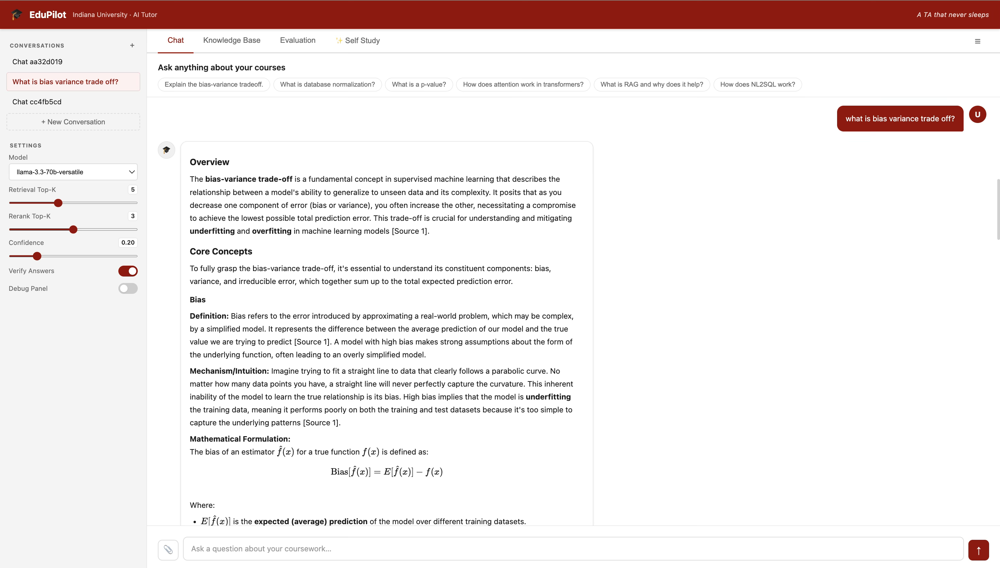
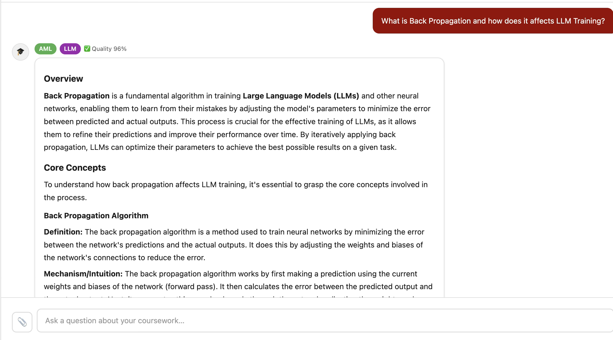
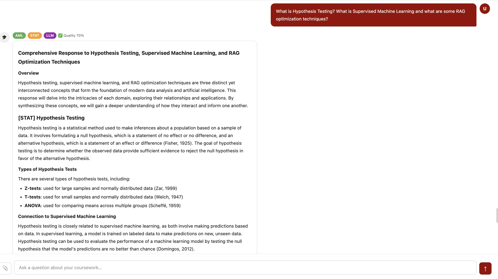
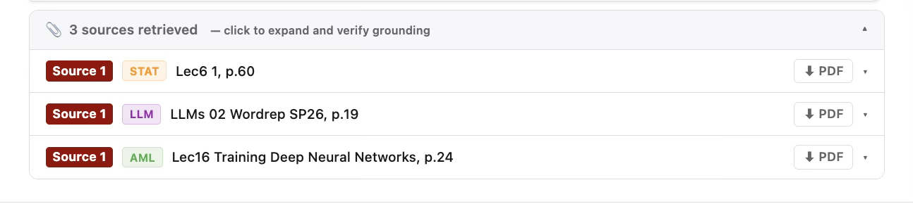
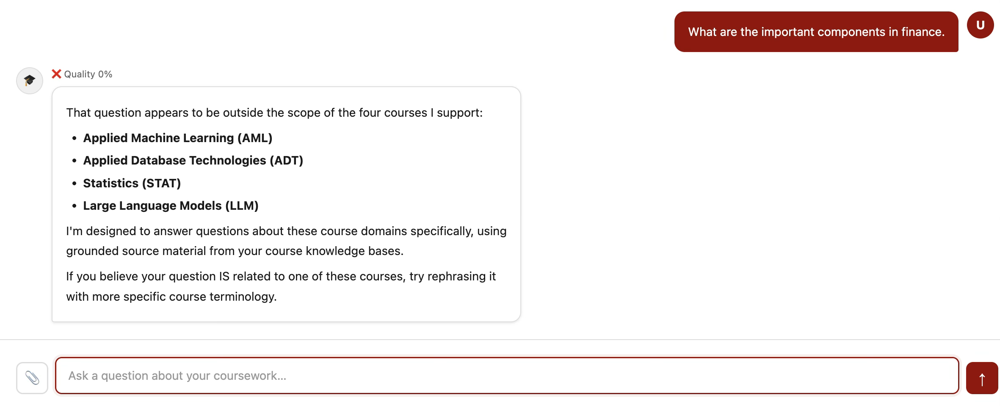
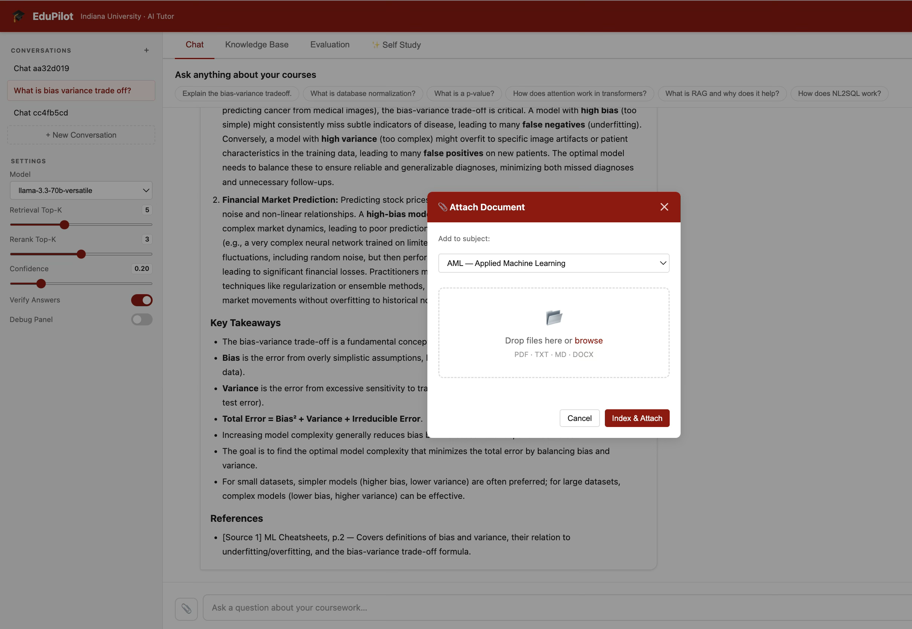
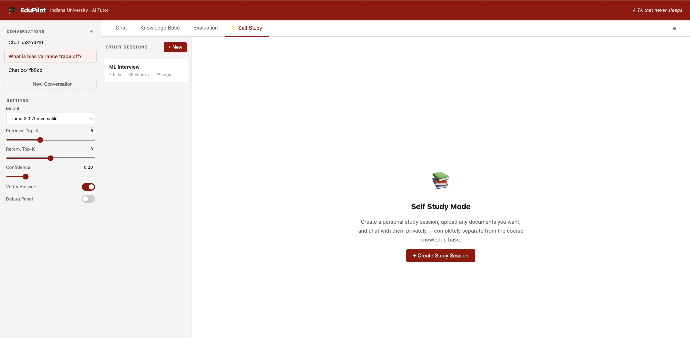
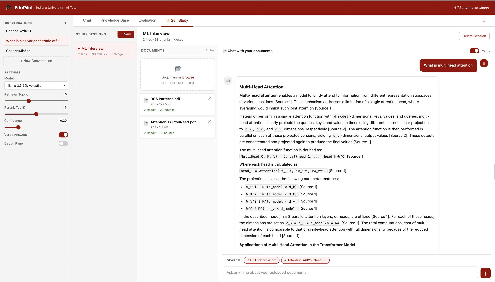
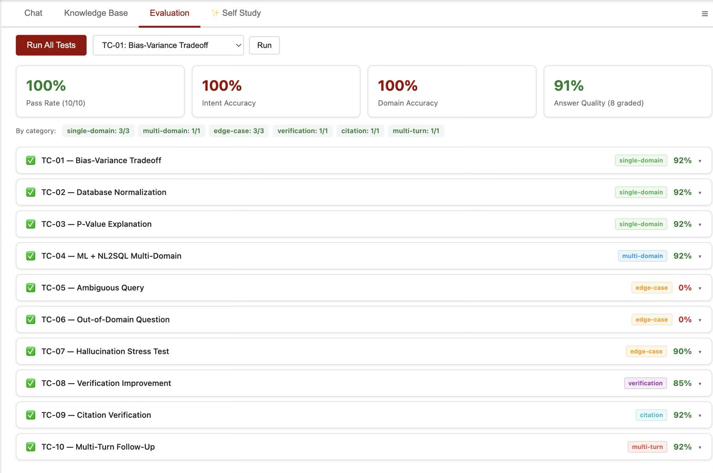

# EduPilot — AI Tutor for Indiana University

> **A Multi-Agent, Source-Grounded Educational AI System for Adaptive and Cross-Domain Learning**

EduPilot is an intelligent course assistant built for Indiana University students. It answers questions across four graduate courses — Applied Machine Learning (AML), Applied Database Technologies (ADT), Statistics (STAT), and Large Language Models (LLM) — using a seven-stage multi-agent RAG pipeline that retrieves directly from course lecture slides and materials, cites every claim, verifies its own answers, and refuses to hallucinate.

**Built by:** Akshar Patel · Khushi Shah  
**Institution:** Indiana University Bloomington

---

## Table of Contents

- [Overview](#overview)
- [Key Features](#key-features)
- [System Architecture](#system-architecture)
- [Screenshots](#screenshots)
- [Tech Stack](#tech-stack)
- [Project Structure](#project-structure)
- [Setup and Installation](#setup-and-installation)
- [Running the Application](#running-the-application)
- [Evaluation Suite](#evaluation-suite)
- [Configuration](#configuration)
- [API Reference](#api-reference)
- [Authors](#authors)

---

## Overview

EduPilot solves a core problem in educational AI: **LLMs hallucinate**. Generic chatbots answer confidently with no connection to actual course materials, making them unreliable for exam prep or homework help.

EduPilot's approach:

1. **Every answer is grounded** in the course knowledge base — retrieved chunks from real lecture slides, not GPT's parametric memory.
2. **Every claim is cited** with a `[Source N]` marker linking back to the exact lecture and page number.
3. **Every answer is verified** — a two-pass verifier checks quality (≥ 0.75) and coverage (≥ 0.70), and rewrites the answer if either threshold is missed.
4. **Cross-domain queries** are decomposed into sub-questions, answered independently per domain, and synthesized into a unified response.
5. **Out-of-domain questions** are politely refused rather than answered with hallucinated content.

---

## Key Features

| Feature | Description |
|---|---|
| **Multi-agent pipeline** | 7 independent agents: Router → Splitter → Retriever → Reranker → Generator → Synthesizer → Verifier |
| **Hybrid retrieval** | Reciprocal Rank Fusion over dense + sparse (and optionally HyDE / multi-query) probes, served natively by Pinecone |
| **Source citations** | Every answer includes `[Source N]` markers with lecture name and page number |
| **Two-pass verification** | Self-grading on quality and coverage; targeted rewrite if thresholds not met |
| **Cross-domain synthesis** | Automatically detects multi-domain queries and retrieves from each domain separately |
| **Out-of-domain guard** | Hard refusal for questions outside AML, ADT, STAT, LLM scope |
| **Self Study Mode** | Upload any personal documents (PDF, TXT, DOCX) and chat with them privately |
| **Evaluation suite** | 50 test cases and 8 objective metrics — run a case from the Evaluation tab, or the whole suite with `edupilot-evaluate` |
| **Blue/green indexing** | Rebuilds write to a new index version and promote only on success — a failed rebuild changes nothing |
| **Auth + guardrails** | JWT auth with per-user ownership, rate limiting, upload validation, and prompt-injection scanning |
| **Answer cache** | Questions asked 3+ times are cached by semantic match, scoped to the index version and swept on rebuild |
| **Conversation memory** | Recent turns kept verbatim; older ones fold into a rolling per-session digest |
| **Model selector** | Switch between Groq (Llama 3.3 70B, Llama 3.1 8B) and Gemini fallback at runtime |
| **Debug panel** | Real-time view of retrieved chunks, reranking scores, and verification reasoning |

---

## System Architecture

EduPilot processes every query through a seven-stage pipeline:

```
Student Query
     │
     ▼
┌─────────────────────────────────┐
│  Stage 1 — ROUTER               │  Classifies intent (single / multi / OOD)
│  Intent & domain detection      │  Keyword fallback if LLM API fails
│  + clarification guard          │
└──────────────┬──────────────────┘
               │
     ┌─────────┴──────────┐
     │ single-domain      │ multi-domain
     ▼                    ▼
┌──────────┐   ┌──────────────────────────┐
│ Stage 2  │   │  Stage 2 — QUERY         │
│ (bypass) │   │  SPLITTER                │  Decomposes into N sub-questions
└────┬─────┘   └──────────┬───────────────┘
     │                    │ (one branch per domain)
     ▼                    ▼
┌─────────────────────────────────┐
│  Stage 3 — HYBRID RETRIEVER     │  Pinecone dense + sparse, one query
│  RRF(c) = Σ w_r / (k + rank_r) │  k=60, weighted per probe
│  bge-small-en-v1.5  (384-dim)  │  Top-K = 8 candidates
└──────────────┬──────────────────┘
               │
               ▼
┌─────────────────────────────────┐
│  Stage 4 — RERANKER             │  bge-reranker-base cross-encoder
│  Filters to Top-K = 5 chunks    │  Calibrated per-model relevance floor
└──────────────┬──────────────────┘
               │
               ▼
┌─────────────────────────────────┐
│  Stage 5 — DOMAIN AGENT(S)      │  One LLM call per domain
│  Groq Llama 3.3 70B             │  Prompt: retrieved context + citations
│  Gemini fallback (auto)         │
└──────────────┬──────────────────┘
               │
               ▼
┌─────────────────────────────────┐
│  Stage 6 — SYNTHESIZER          │  Merges multi-domain answers
│  (single-domain: pass-through)  │  into one coherent response
└──────────────┬──────────────────┘
               │
               ▼
┌─────────────────────────────────┐
│  Stage 7 — VERIFIER             │  Scores quality (≥ 0.75) + coverage (≥ 0.70)
│  Two-pass self-grading          │  Targeted rewrite if below threshold
│  4.6× token efficiency gain     │
└──────────────┬──────────────────┘
               │
               ▼
        Final Answer
    (cited, verified, grounded)
```

### Knowledge Domains

| Domain | Code | Colour | Coverage |
|---|---|---|---|
| Applied Machine Learning | **AML** | Green | Supervised/unsupervised learning, deep learning, optimisation |
| Applied Database Technologies | **ADT** | Blue | SQL, NoSQL, normalisation, transactions, data warehousing |
| Statistics | **STAT** | Orange | Probability, hypothesis testing, regression, Bayesian inference |
| Large Language Models | **LLM** | Purple | Transformers, attention, fine-tuning, RAG, prompt engineering |

---

## Screenshots

### Main Chat Interface

The full EduPilot UI — conversation history in the left sidebar, model and retrieval settings below it, suggested questions at the top, and the main answer pane. Domain tags (AML, ADT, STAT, LLM) badge every response.



---

### High-Quality Single-Domain Answer (96% Quality)

EduPilot answers a cross-domain question about Backpropagation and LLM Training with a 96% quality score. The response is structured into Overview, Core Concepts, Algorithm definition, and Mechanism sections — all grounded in retrieved course material.



---

### Multi-Domain Answer (AML + STAT + LLM)

A query spanning three domains ("Hypothesis Testing, Supervised ML, and RAG optimisation techniques") is automatically decomposed. Each part is retrieved independently, then synthesized into one unified answer. Domain badges show which knowledge base each section came from.



---

### Source Citations Panel

Every answer includes an expandable citations panel showing exactly which lecture slide and page each source came from. Sources span multiple domains (STAT, LLM, AML) in a single response and are downloadable as PDFs.



---

### Out-of-Domain Rejection

When a question falls outside the four supported courses (e.g., "What are the important components in finance?"), EduPilot refuses to answer rather than hallucinate, and clearly lists the four supported domains.



---

### Document Upload to Knowledge Base

Instructors or students can extend any domain knowledge base by attaching PDF, TXT, or DOCX files through the drag-and-drop upload modal. Files are indexed into Pinecone and BM25 automatically.



---

### Self Study Mode

Self Study Mode lets students upload any personal documents — notes, textbooks, past papers — and chat with them privately. This is completely separate from the course knowledge base and does not affect other users.



---

### Self Study Session — Active Chat

An active "ML Interview" study session with two uploaded PDFs (38 chunks). EduPilot answers a question about Multi-Head Attention with inline `[Source N]` citations drawn exclusively from the uploaded documents.



---

### Evaluation Dashboard

The evaluation dashboard from the original Streamlit UI, showing results across the 10-case suite — 100% intent accuracy, 100% domain accuracy, retrieval hit rate 0.49, mean quality 0.84, and citation accuracy 1.00 with the primary model (Llama-3.3-70B).

*This screenshot is historical.* The Streamlit UI has been retired in favour of the bundled single-page frontend, and the suite now runs from the command line with `edupilot-evaluate`, which prints the same scorecard.



---

## Tech Stack

| Layer | Technology |
|---|---|
| **LLM** | Groq (Llama 3.3 70B Versatile, Llama 3.1 8B Instant, Gemma 2 9B) · Gemini 2.0/2.5 Flash (fallback) |
| **Embeddings** | `BAAI/bge-small-en-v1.5` (384-dim, 512-token window, asymmetric query prefix) |
| **Vector Store** | Pinecone Serverless, `dotproduct` metric, versioned blue/green indexes |
| **Keyword Search** | BM25 term weights computed at ingest, stored as Pinecone **sparse vectors** (no in-memory index) |
| **Fusion** | Reciprocal Rank Fusion across dense / sparse / HyDE / multi-query probes |
| **Reranking** | `BAAI/bge-reranker-base` cross-encoder, with a per-model calibrated relevance floor |
| **Backend** | FastAPI + Uvicorn (async, worker pool for blocking calls) |
| **Frontend** | Vanilla JS single-page app, served from `edupilot/web/static` |
| **Database** | SQLite (WAL, versioned schema with migrations) |
| **Document Parsing** | PyMuPDF + pdfplumber (PDF, tables) · python-docx (DOCX) · Tesseract (OCR fallback) |
| **Auth** | JWT access tokens + rotating refresh tokens, bcrypt password hashing |
| **Environment** | Python 3.11+ · `python-dotenv` |

---

## Project Structure

A `src/` layout: importable code lives in `src/edupilot`, everything the
application reads or writes at runtime lives in `data/`. Only `data/` needs to
be writable, and it is the only path worth mounting in a container.

```
EduPilot/
├── pyproject.toml               # packaging, dependencies, ruff + pytest config
├── requirements.txt             # thin wrapper: installs the project itself
├── .env.example                 # documented environment template
│
├── src/edupilot/
│   ├── api/                     # HTTP layer — routing and nothing else
│   │   ├── app.py               #   application factory, middleware, error handlers
│   │   ├── deps.py              #   auth annotations, worker pool, validators
│   │   ├── schemas.py           #   pydantic request bodies
│   │   └── routes/              #   one module per resource
│   │       ├── auth.py          #     register / login / refresh / logout / me
│   │       ├── chat.py          #     the multi-agent course-chat endpoint
│   │       ├── sessions.py      #     conversation history
│   │       ├── knowledge_base.py#     shared corpus (admin-gated writes)
│   │       ├── self_study.py    #     private per-student documents + chat
│   │       ├── evaluation.py    #     test-case listing
│   │       └── system.py        #     SPA entry, health, client config
│   │
│   ├── agents/                  # router → splitter → answerer → synthesizer → verifier
│   │   ├── pipeline.py          #   orchestration
│   │   ├── contracts.py         #   typed inter-agent payloads
│   │   └── prompts.py           #   every LLM prompt template
│   │
│   ├── retrieval/               # embeddings, vector store, hybrid search, reranking
│   │   ├── embeddings.py        #   embedder + on-disk embedding cache
│   │   ├── vectorstore.py       #   Pinecone and in-memory backends
│   │   ├── sparse.py            #   BM25 term weights for sparse vectors
│   │   ├── hybrid.py            #   RRF fusion across probes
│   │   ├── query_transform.py   #   acronym expansion, multi-query, HyDE
│   │   ├── rerank.py            #   cross-encoder + calibrated floors
│   │   └── indexer.py           #   ingest orchestration, blue/green rebuilds
│   │
│   ├── ingestion/               # document → blocks → sections → chunks
│   │   ├── pdf.py               #   PyMuPDF + pdfplumber + OCR fallback
│   │   ├── office.py            #   DOCX and Markdown
│   │   ├── normalize.py         #   header/footer stripping, unicode cleanup
│   │   ├── chunking.py          #   token-aware, section-respecting chunker
│   │   └── models.py            #   Block / Section / ParsedDocument
│   │
│   ├── guardrails/              # citation, grounding, injection, output checks
│   ├── security/                # auth, rate limiting, uploads, error envelopes
│   ├── evaluation/              # cases.py (50 cases) · metrics.py · runner.py
│   ├── llm/                     # provider-agnostic client with fallback chain
│   ├── db/                      # SQLite: connection · schema · chat · documents · self_study
│   ├── core/                    # config · services (composition root) · observability
│   ├── cli/                     # edupilot-reindex, edupilot-evaluate
│   └── web/static/              # single-page frontend (ships with the package)
│
├── tests/                       # pytest suite (pinned to a throwaway DATA_DIR)
├── docs/screenshots/            # UI screenshots used in this README
│
└── data/                        # gitignored — all runtime state
    ├── knowledge_base/          #   aml/ adt/ stats/ llm/
    ├── self_study_files/        #   per-session student uploads
    ├── state/                   #   embedding cache, BM25 table, index pointer
    └── edupilot.db              #   sessions, messages, chunks, users
```

---

## Setup and Installation

### Prerequisites

- Python 3.11 or higher
- A [Groq](https://console.groq.com) API key (free tier available)
- A [Pinecone](https://app.pinecone.io) API key — the index is created automatically on first rebuild
- (Optional) A [Google Gemini](https://aistudio.google.com) API key for fallback
- (Optional) Tesseract OCR, for scanned PDF pages without a text layer:
  `brew install tesseract` / `apt-get install tesseract-ocr`

### 1. Clone the repository

```bash
git clone https://github.com/Akshar106/EduPilot-A-Multi-Agent-Source-Grounded-Educational-AI-System-for-Adaptive-and-Cross-Domain-Learning.git
cd EduPilot-A-Multi-Agent-Source-Grounded-Educational-AI-System-for-Adaptive-and-Cross-Domain-Learning
```

### 2. Create a virtual environment

```bash
python3 -m venv .venv
source .venv/bin/activate       # macOS / Linux
# .venv\Scripts\activate        # Windows
```

### 3. Install the project

Installs `edupilot` in editable mode along with every dependency:

```bash
pip install -e ".[dev]"
```

Drop the `[dev]` extra for a runtime-only install, or use `pip install -r requirements.txt`, which does the same thing.

### 4. Configure environment variables

Copy the documented template and fill it in — every variable is explained inline:

```bash
cp .env.example .env
```

At minimum set `GROQ_API_KEY`, `PINECONE_API_KEY`, and `JWT_SECRET_KEY`. Generate the signing key with:

```bash
python3 -c "import secrets; print(secrets.token_urlsafe(48))"
```

Set `BOOTSTRAP_ADMIN_EMAIL` and `BOOTSTRAP_ADMIN_PASSWORD` too — the first admin is created on startup when no users exist, and without one the knowledge-base routes are unreachable.

### 5. Add course materials to the knowledge base

Place PDF, TXT, MD, or DOCX files into the appropriate subdirectory:

```
data/knowledge_base/aml/      ← AML lecture slides
data/knowledge_base/adt/      ← ADT materials
data/knowledge_base/stats/    ← Statistics notes
data/knowledge_base/llm/      ← LLM course materials
```

### 6. Build the index

```bash
edupilot-reindex --rebuild
```

This extracts, chunks, embeds, and upserts every document into a **new** index version, promoting it only after all four domains succeed. The live index keeps serving throughout, so a failed rebuild changes nothing. Check the result with `edupilot-reindex --status`.

Admins can also add documents at runtime via `POST /api/kb/upload`, which indexes incrementally.

---

## Running the Application

```bash
uvicorn edupilot.api.app:app --host 0.0.0.0 --port 8000 --reload
```

- App: `http://localhost:8000`
- Interactive docs: `http://localhost:8000/docs` (disabled when `EDUPILOT_ENV=production`)

The frontend is a single-page app served by the same process — there is no separate UI server to start.

### Single-user mode

By default in development, `EDUPILOT_AUTH_REQUIRED=false`: there is no sign-in, and every request resolves to one fixed local identity (`local-single-user`) with admin rights. That is what lets the bundled frontend work without a login screen. Access control is not removed — sessions and uploads still carry an owner, and every ownership check still runs; there is simply one owner.

Production always requires authentication. Setting `EDUPILOT_AUTH_REQUIRED=false` with `EDUPILOT_ENV=production` is **refused at startup**, because an open knowledge base lets any visitor inject documents that every student's answers are then grounded in.

To require sign-in locally, set `EDUPILOT_AUTH_REQUIRED=true` and register through `POST /api/auth/register`. Note the bundled frontend has no login UI, so it will need one before that mode is usable in a browser.

### Troubleshooting

**`ModuleNotFoundError: No module named 'edupilot'`** — the editable install's `.pth` file is not being honoured. On macOS this happens when the repo lives in an iCloud-synced folder (`~/Documents` with Desktop & Documents sync on): iCloud sets the `hidden` flag on files inside `.venv`, and Python 3.14 skips hidden `.pth` files. Work around it with an explicit path, or move the repo outside the synced folder:

```bash
PYTHONPATH="$PWD/src" uvicorn edupilot.api.app:app --reload --port 8000
```

**`bad interpreter` when running `.venv/bin/uvicorn`** — the script's shebang is baked in at install time and breaks if the project moves, or if the absolute path exceeds the kernel's ~127-character shebang limit. Invoke the module instead, which has no shebang:

```bash
./.venv/bin/python -m uvicorn edupilot.api.app:app --reload --port 8000
```

---

## Evaluation Suite

EduPilot ships with a **50-case evaluation suite** covering all pipeline layers across four categories:

| Category | Cases | Description |
|---|---|---|
| Single-domain | 25 | Factual and conceptual queries spanning AML, ADT, STAT, and LLM domains |
| Multi-domain | 10 | Cross-domain queries requiring multi-namespace synthesis |
| Edge-case | 8 | Out-of-domain, ambiguous, and empty-retrieval cases that should refuse |
| Adversarial | 7 | Fabricated concepts and false-premise queries stressing hallucination resistance |
| **Total** | **50** | |

### Reported results — 10-case suite, Llama-3.3-70B

> These figures come from the original 10-case suite used in the project report. The suite has since grown to 50 cases, so they are kept for reference rather than as current numbers. Re-run `edupilot-evaluate` to measure the present system.

| Category | N | Intent | Hit Rate | Quality |
|---|---|---|---|---|
| Single-domain | 6 | 1.00 | 0.53 | 0.91 |
| Multi-domain | 2 | 1.00 | 0.50 | 0.70 |
| Adversarial | 2 | 1.00 | 0.20 | 0.70 |
| **Overall** | **10** | **1.00** | **0.49** | **0.84** |

Citation accuracy: **1.00** across all generating queries. No verifier revisions triggered.

### Eight metrics measured per query

| Metric | What it measures |
|---|---|
| Intent Match | Router correctly classified single vs. multi intent |
| Domain Match | Router routed to the correct domain(s) |
| Retrieval Hit Rate | Fraction of expected keywords found in retrieved chunks |
| Faithfulness | LLM-judged grounding of answer in retrieved evidence |
| Citation Accuracy | `[Source N]` markers match their referenced chunks |
| Quality Score | Verifier rubric score (0.95–1.00 Exceptional, 0.70–0.84 Adequate) |
| Coverage Score | Sub-topics addressed relative to expected behavior |
| Latency (ms) | End-to-end wall-clock time |

### Model comparison (10 queries, 3 providers)

| Metric | Llama-3.3-70B | Llama-3.1-8B | Gemini-2.5-Flash |
|---|---|---|---|
| Quality score | **0.842** | 0.830 | 0.847 |
| Citation accuracy | **1.000** | 0.270 | **1.000** |
| Faithfulness | 0.662 | **0.725** | 0.450 |
| Avg latency (ms) | **13,785** | 15,073 | 15,117 |

Key finding: a **3.7× citation-accuracy gap** between Llama-70B and Llama-8B on identical inputs — purely from model choice.

### Running the evaluation

```bash
edupilot-evaluate
```

Useful flags:

```bash
edupilot-evaluate --category edge-case              # one category
edupilot-evaluate --case TC-01 --case TC-04         # specific cases
edupilot-evaluate --model llama-3.1-8b-instant      # compare a model
edupilot-evaluate --json results.json               # machine-readable output
```

A scorecard prints to stdout; `--json` additionally writes per-case results. The command exits non-zero when any case fails, so it works as a CI gate. Reproduce the model comparison above by running it once per model with `--model` and `--json`.

A full pass is hundreds of LLM calls, which is why it is a CLI rather than an API route — `GET /api/evaluate/cases` only *lists* the suite.

---

## Configuration

Tunable parameters live in `src/edupilot/core/config.py`. Anything read from the environment is documented in `.env.example`.

```python
# Retrieval
DEFAULT_TOP_K = 8                   # candidates retrieved before reranking
DEFAULT_RERANK_TOP_K = 5            # chunks passed to the LLM after reranking

# Chunking — measured in embedding-model TOKENS, not words
CHUNK_MAX_TOKENS = 448              # hard ceiling, under the 512-token window
CHUNK_TARGET_TOKENS = 320           # preferred size
CHUNK_MIN_TOKENS = 64               # below this, merge into a neighbour
PARENT_MAX_TOKENS = 1400            # wider window for small-to-big retrieval

# Query transformation — each LLM-backed step costs a round-trip, so both
# default off. Acronym expansion is deterministic and always on.
ENABLE_MULTI_QUERY = False
ENABLE_HYDE = False
ENABLE_PARENT_EXPANSION = True

# Models
DEFAULT_MODEL   = "llama-3.3-70b-versatile"   # Groq
VERIFY_MODEL    = "llama-3.3-70b-versatile"
EMBEDDING_MODEL = "BAAI/bge-small-en-v1.5"
RERANKER_MODEL  = "BAAI/bge-reranker-base"
```

Two knobs deliberately live next to the code that applies them rather than here:

- **RRF weights** — `PROBE_WEIGHTS` and `RRF_K` in `retrieval/hybrid.py`. Fusion weights each *probe* (dense, sparse, HyDE, multi-query), not two fixed modalities, so a pair of scalars could not express it.
- **Minimum relevance** — calibrated per reranker in `retrieval/rerank.py`, because the score scale is model-specific. Set `DEFAULT_MIN_RELEVANCE` to override.

### Adding a course domain

Add one entry to `DOMAINS` in `config.py`, drop files into `data/knowledge_base/<dir>/`, and run `edupilot-reindex --rebuild`. No other code changes are needed — routing, retrieval, and the frontend all read the registry.

---

## API Reference

Every route is rate limited and returns a typed error envelope. All routes except `GET /`, `GET /api/health`, `GET /api/config`, and the auth entry points require a bearer token; knowledge-base writes require the `admin` role.

| Method | Path | Auth | Purpose |
|---|---|---|---|
| `POST` | `/api/auth/register` | — | Create an account |
| `POST` | `/api/auth/login` | — | Exchange credentials for tokens |
| `POST` | `/api/auth/refresh` | — | Rotate a refresh token |
| `POST` | `/api/auth/logout` | user | Revoke all refresh tokens |
| `GET` | `/api/auth/me` | user | Current identity |
| `GET` | `/api/health` | — | Dependency readiness |
| `GET` | `/api/config` | — | Models, domains, defaults for the frontend |
| `POST` | `/api/chat` | user | Full multi-agent pipeline |
| `GET`/`POST` | `/api/sessions` | user | List / create conversations |
| `GET`/`DELETE` | `/api/sessions/{id}` | owner | Read / delete one conversation |
| `DELETE` | `/api/sessions/{id}/messages/{mid}` | owner | Truncate from a message (edit-and-resend) |
| `GET` | `/api/kb/status` | user | Per-domain chunk counts and documents |
| `GET` | `/api/kb/documents` | user | Indexed documents by domain |
| `POST` | `/api/kb/upload` | **admin** | Add documents to the shared corpus |
| `DELETE` | `/api/kb/{domain}/{filename}` | **admin** | Remove a document and its vectors |
| `GET` | `/api/documents/{domain}/{filename}` | user | Serve a source PDF behind a citation |
| `GET`/`POST` | `/api/self-study/sessions` | user | List / create private study sessions |
| `GET`/`DELETE` | `/api/self-study/sessions/{id}` | owner | Read / delete a study session |
| `POST` | `/api/self-study/sessions/{id}/upload` | owner | Upload private documents |
| `DELETE` | `/api/self-study/sessions/{id}/documents/{doc_id}` | owner | Remove one private document |
| `POST` | `/api/self-study/chat` | owner | Chat over your own documents |
| `GET` | `/api/evaluate/cases` | user | List the 50 test cases |

### `POST /api/chat`

**Request:**
```json
{
  "query": "What is the bias-variance tradeoff?",
  "session_id": "abc123",
  "model": "llama-3.3-70b-versatile",
  "top_k": 8,
  "rerank_top_k": 5,
  "enable_verification": true
}
```

`session_id` is optional — omit it and a new session is created, owned by the caller. Ownership always comes from the bearer token, never from the body.

**Response:**
```json
{
  "session_id": "abc123",
  "final_answer": "The bias-variance tradeoff describes...",
  "intent_type": "single",
  "detected_domains": ["AML"],
  "is_course_related": true,
  "needs_clarification": false,
  "refused": false,
  "grounding_score": 0.92,
  "guardrail_action": "pass",
  "sources": [
    { "source_num": 1, "citation_label": "AML · Lec3 p.12", "text": "..." }
  ],
  "debug": { "retrieval": {}, "guardrails": {}, "usage": {} }
}
```

`grounding_score` is `null` when grounding was not measured — it is never defaulted or floored, so a missing score is distinguishable from a low one.

---

## Authors

| Name | Email | Contributions |
|---|---|---|
| **Akshar Patel** | akspate@iu.edu | System architecture, hybrid retrieval pipeline (Pinecone + BM25 + RRF), query router with keyword fallback, query splitter, SQLite database layer, FastAPI async backend, confidence-thresholded reranker, evaluation suite construction, report writing |
| **Khushi Shah** | khusshah@iu.edu | Domain agent prompt engineering, cross-domain synthesizer, two-pass verifier with targeted revision, Self Study module, Streamlit debug UI, all seven prompt templates, evaluation framework (10 queries, 8 metrics, three categories), 3-model comparison analysis, primary report writing |

Indiana University Bloomington · Luddy School of Informatics, Computing, and Engineering

---

*EduPilot — A TA that never sleeps.*
